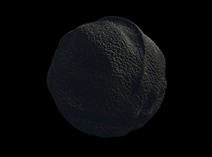

<link rel="stylesheet" href="styles.css" type="text/css">

I like to analyze data to answer research questions and really like systems thinking. Currently I investigate questions related to breast cancer through my work as a Research Biostatistician and System administrator at [Integrative medicine/ Clincal Naturopathy - Charite Medical University](http://naturheilkunde.immanuel.de/home/) in the department of Epidemiology & Health economics and Social medicine. 

I graduated from the [Technical University of Dresden](http://www.sph.umn.edu/academics/divisions/biostatistics/) with a MS in biology in 2010. In 2012 I began working toward my PhD in clincal studies at [Psychosomatic - Charite Medical University](prof. deter charite), where I was investigating placebo effects and its psychoneuroendocrine responses. I expect to graduate in bioinformatics by the end of 2019.

I am a R enthusiast, including serving on the board and being an active member of [Berlin R User Group](https://www.meetup.com/de-DE/Berlin-R-Users-Group/). 

My full CV is available [here](files/CV.pdf).
