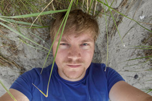

---
title: "Home"
author: "Nico Steckhan"
output: html_document
---

<link rel="stylesheet" href="styles.css" type="text/css">

I am a postdoctoral researcher in the AI junior research group at the [Federal Institute for Occupational Safety and Health (BAuA)](https://www.baua.de/EN/Home/Home_node.html) and a guest scientist in Connected Healthcare at the [Hasso Plattner Institute](https://hpi.de/en/research/research-groups-and-labs/connected-healthcare/). My work sits at the intersection of data science, machine learning, and digital health, with a focus on multimodal sensor data, wearable and IoT systems, and real-world health applications.

Before joining BAuA, I held postdoctoral positions at TU Dresden, [Charite Universitatsmedizin Berlin](https://www.charite.de/en/), the [Max Delbruck Center](https://www.mdc-berlin.de/), and the Hasso Plattner Institute. Across these roles, I have worked on clinical and translational research, digital diabetology, physiological sensing, and evidence-based digital health systems.

I hold a Dr. rer. medic. from [Charite Universitatsmedizin Berlin](https://www.charite.de/en/), an M.Sc. in Bioinformatics from the [University of Potsdam](https://www.uni-potsdam.de/en/), and a Diplom in Biology from the [Technical University of Dresden](https://tu-dresden.de/). I work mainly with R and Python and enjoy building research infrastructure, proof-of-concept systems, and reproducible analysis workflows.

My full CV is available [here](files/CV.pdf). You can also find my work on [ResearchGate](https://www.researchgate.net/profile/Nico-Steckhan) and [Google Scholar](https://scholar.google.com/citations?user=nwX1I8EAAAAJ&hl=en).

